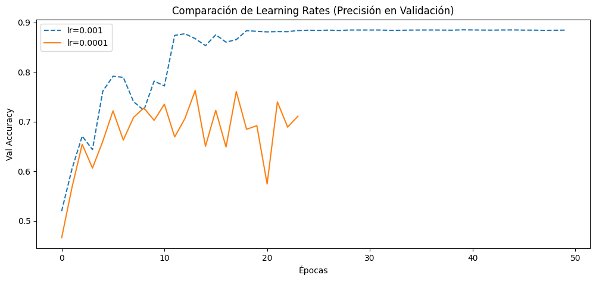
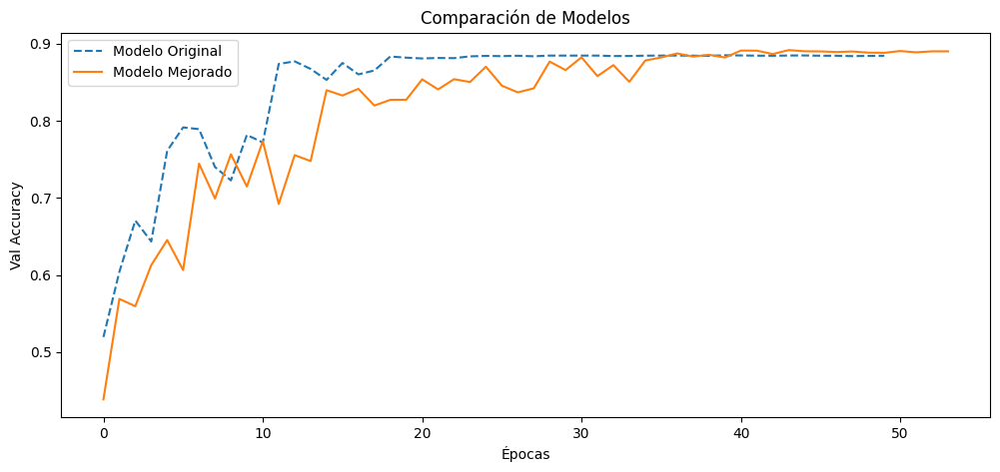

# 🧠 Clasificación de Imágenes con Transfer Learning (CIFAR-10)

Este proyecto entrena una red neuronal convolucional (CNN) utilizando aprendizaje por transferencia para clasificar imágenes del dataset **CIFAR-10** en 10 categorías. Se aplicaron técnicas de regularización, ajuste de tasa de aprendizaje y aumento de datos para mejorar el rendimiento del modelo final.

---

## 🖼️ Dataset

Se utilizó el dataset [CIFAR-10](https://www.cs.toronto.edu/~kriz/cifar.html), compuesto por 60,000 imágenes en color de 32x32 píxeles, distribuidas equitativamente en 10 clases:

- Avión, Automóvil, Pájaro, Gato, Ciervo, Perro, Rana, Caballo, Barco, Camión

---

## ⚙️ Tecnologías utilizadas

- Python 3
- TensorFlow / Keras
- NumPy
- Matplotlib
- scikit-learn

---

## 📁 Estructura del proyecto

```

├── model/
│   └── all_cnn_cifar10.keras         # Modelo final optimizado
├── results/
│   ├── comparacion_lr.png            # Gráfica: efecto del learning rate
│   ├── comparacion_modelos.png       # Gráfica: modelo base vs optimizado
├── cifar10_transfer_learning.ipynb   # Notebook completo
├── requirements.txt
├── .gitignore
└── README.md

````

---

## 🔬 Comparaciones

### 1. Efecto del Learning Rate


Reducir la tasa de aprendizaje (`lr=0.0001`) mejoró la estabilidad pero no superó el rendimiento del modelo base con `lr=0.001`.

---

### 2. Mejora del Modelo con Regularización y Augmentation


El modelo optimizado con técnicas como `dropout`, `L2 regularización` y `data augmentation` logró una mayor precisión y mejor generalización, alcanzando un **89.04% de accuracy en validación**.

---

## 🧪 Evaluación

El modelo fue evaluado con métricas de clasificación (precision, recall, F1-score). Se identificaron clases más desafiantes como "gato" y "pájaro", mientras que clases como "automóvil" y "camión" fueron clasificadas con mayor precisión.

---

## 🚀 Cómo ejecutar una prueba rápida

1. Clona el repositorio:

```bash
   git clone https://github.com/tu_usuario/cifar10-transfer-learning.git
   cd cifar10-transfer-learning
````

2. Asegúrate de tener TensorFlow y las dependencias necesarias instaladas:

```bash
   pip install -r requirements.txt
```

3. Carga el modelo y prueba una imagen aleatoria del set de prueba:

```python
   from tensorflow.keras.models import load_model
   from tensorflow.keras.datasets import cifar10
   import numpy as np
   import matplotlib.pyplot as plt

   model = load_model('model/all_cnn_cifar10.keras')
   (_, _), (x_test, y_test) = cifar10.load_data()

   # Mostrar una predicción
   idx = np.random.randint(0, len(x_test))
   img = x_test[idx]
   pred = model.predict(img[np.newaxis, ...])
   label = np.argmax(pred)

   plt.imshow(img)
   plt.title(f'Predicción: {label}')
   plt.axis('off')
   plt.show()
```

---

## 📄 Licencia

Este proyecto está bajo la licencia MIT.

---

## 👤 Autor

Proyecto desarrollado por Alexis Martínez como parte de un estudio práctico sobre técnicas de transferencia y regularización para visión por computador.